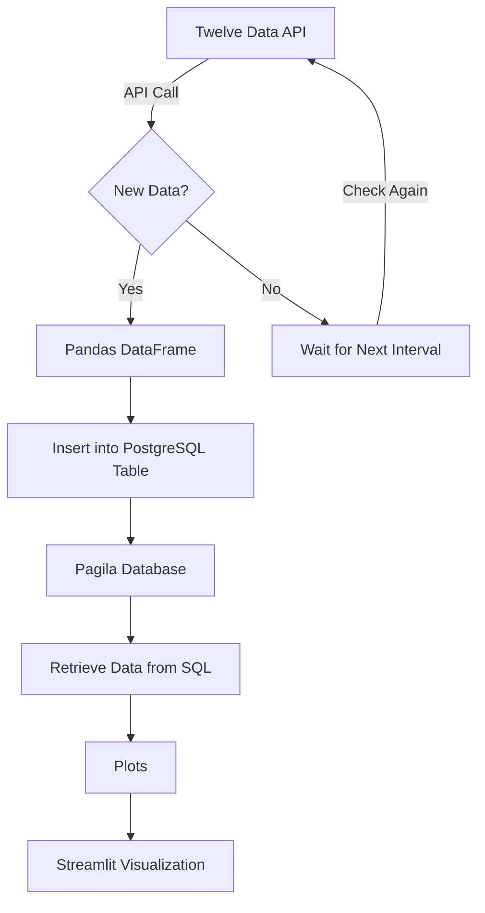

# Minimal Viable Product (MVP) Requirements

## Overview
The goal is to pull in data from the Twelve Data API to obtain some stocks and crypto data. I then transform them locally and combine them to obtain a single source of truth (SSOT). I then load this into the PostgreSQL Pagila database, with the code to update the database running periodically (hourly). Finally, I pull the data out and make some visualizations using Streamlit.

---
### To Run ETL pipeline:
- on the root folder, run 'python -m scripts.run_etl`. The scheduler should run hourly

## Requirements

### 1. **Data Extraction**
- **Source:** Twelve Data API (Cryptocurrency & Stocks Data)
- **Frequency:** Hourly updates
- **Format:** JSON response converted to Pandas DataFrame
- **Storage:** Initially stored in Pandas for transformation

---

### 2. **Data Transformation**
- **Objective:** Transform the normalized data to create a consolidated single source of truth (SSOT).
- **Operations:**
  - Combine related data fields to create an analysis-friendly dataset.
  - Calculate aggregate values such as averages, price changes, etc.
  - Format data for easier querying by analysts.
- **Why SSOT?**  
  The transformation process helps improve data accessibility and consistency, reducing the need for complex joins and enabling a unified view of the data.

---

### 3. **Data Storage (PostgreSQL - Pagila Schema)**
- **Database:** PostgreSQL (using Pagila schema)
- **Tables:** Store consolidated SSOT data for efficient querying
- **Usage:** Data analysts can access structured data via SQL for reporting and insights.

---

### 4. **Visualization (Real-Time Updates with Streamlit)**
- **Visualization Tool:** Streamlit
- **Purpose:** Present real-time insights using dynamic charts and dashboards
- **Metrics Displayed:**
  - Stock/crypto trends
  - Comparative analysis
  - Moving averages and key indicators
- **Update Frequency:** Dashboard refreshes every minute (or configurable interval)

---

## Goals of the MVP

1. **Establish a Basic Data Pipeline:**  
   - Successfully extract, transform, and store financial data.
   - Ensure end-to-end data flow from API to PostgreSQL and visualization.

2. **Enable Data-Driven Insights:**  
   - Provide a single source of truth through the PostgreSQL database.
   - Ensure easy access for analysts to derive insights.

3. **Optimize Query Performance:**  
   - Improve data structure for faster querying.
   - Ensure minimal response times in dashboards.

4. **Real-Time Visualization:**  
   - Deliver up-to-date metrics using Streamlit for financial insights.
   - Automate refresh intervals to avoid manual intervention.

---

## Data Flow Process

