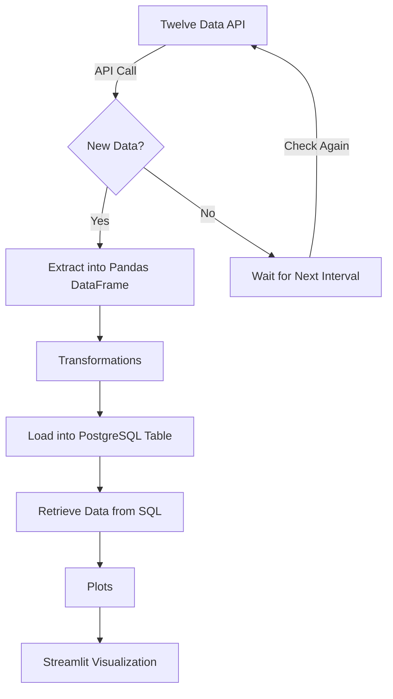
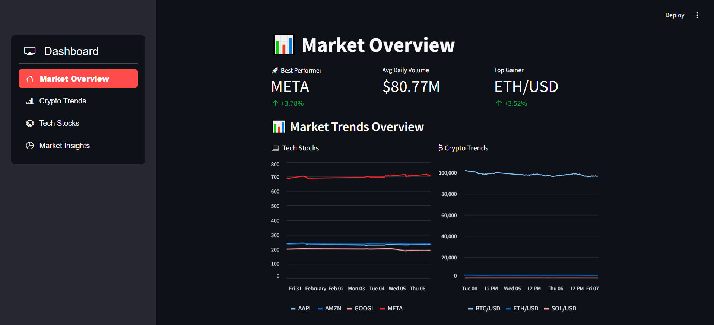
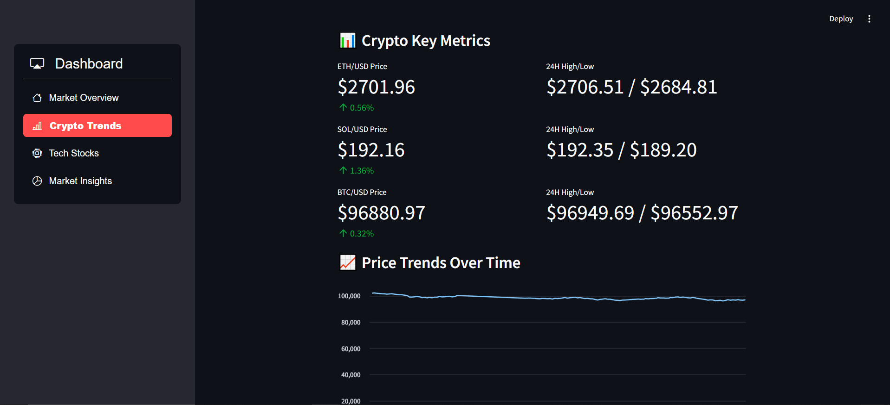
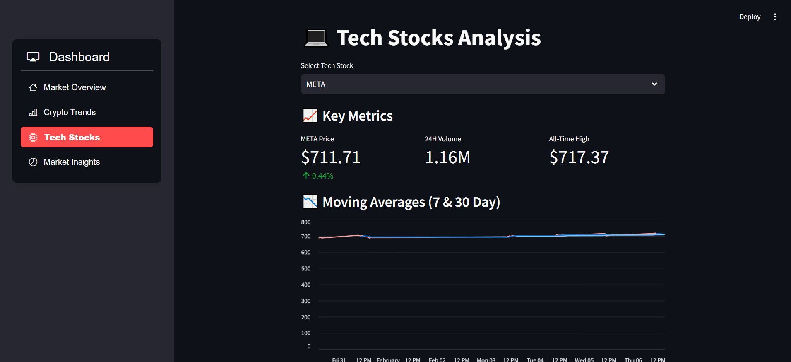
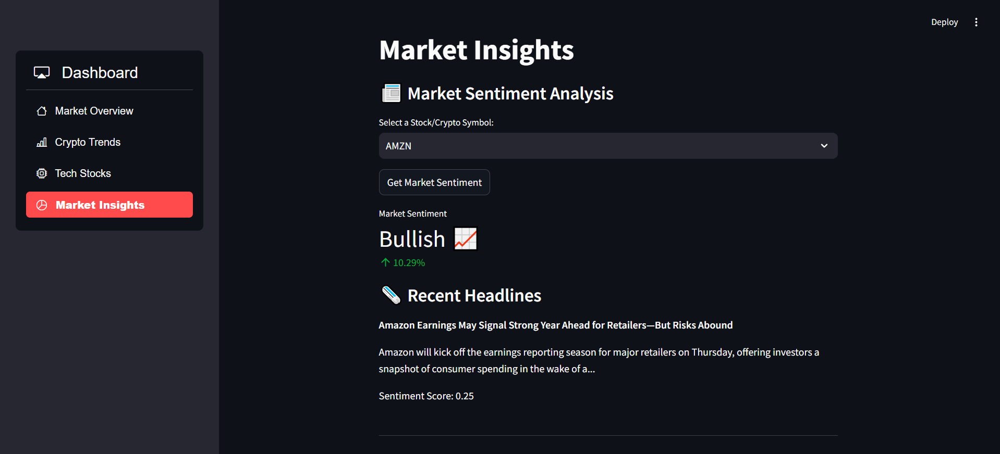

# Capstone Project

## Project Goal

This project aims to extract financial data from the Twelve Data API, process it into a single source of truth (SSOT), store it in a PostgreSQL database, and visualize insights using Streamlit (Scroll down for images).

## Use Case

Traders, analysts, and investors need real-time financial data to make informed decisions. This application demonstrates the ETL process and visualization for stock and cryptocurrency markets. By consolidating data into a structured  database, users can analyse trends, compare assets, and generate insights efficiently. The Streamlit dashboard provides an intuitive interface for real-time analysis.

While there are many established applications  that already offer similar and far more advanced functionalities, this project is not about competition. Instead, it serves as a proof of concept — a functional demonstration of how financial data can be gathered, processed, and used for investment decision making.

## Data Flow Process



## Prerequisites

- Python 3.x installed
- PostgreSQL database set up with the Pagila schema
- Required Python dependencies installed (use `pip install -r requirements.txt`)
- .env file with Twelve Data API key ([Twelve Data API](https://twelvedata.com/))
- .env file with News API key ([News API](https://newsapi.org/))
- .env file with database connection details configured

## Key Components

### **1. Data Extraction**

- **Source:** Twelve Data API (Cryptocurrency & Stocks Data)
- **Frequency:** Hourly updates
- **Format:** JSON response converted to Pandas DataFrame

### **2. Data Transformation**

- **Objective:** Convert raw API data into a structured, analysis-ready format.
- **Operations:**
  - Merge relevant data fields
  - Compute key metrics (e.g., averages, price changes)
  - Structure data for optimized querying

### **3. Data Storage (PostgreSQL - Pagila Schema)**

- **Database:** PostgreSQL (Pagila schema)
- **Purpose:** Store consolidated SSOT data for efficient analysis and reporting.

### **4. Visualization with Streamlit**

- **Tool:** Streamlit

- **Purpose:** Display real-time financial insights

- **Metrics:** Stock/crypto trends, comparisons, key indicators

- **Additional Data Sources:**

  - **News API:** Fetches relevant financial news articles to provide context for market movements.
  - **Sentiment Score Analysis:** Uses sentiment analysis on news data to gauge overall market sentiment and trends.

## Running the ETL Pipeline

To execute the pipeline, run the following command from the root folder:

```sh
python -m scripts.run_etl
```

The scheduler ensures data updates run every hour.

## Running the Streamlit App

To launch the Streamlit dashboard, run:

```sh
streamlit run app.py
```

## Areas of Improvement

- **Utilizing Real-Time API Streaming**: Instead of periodic updates, leverage the API's real-time streaming capabilities to enhance data freshness.
- **Performance Optimization**: Improve data ingestion and transformation efficiency to scale with larger datasets.
- **Enhanced Visualizations**: Integrate more interactive components into the Streamlit dashboard.

## Screenshots

### Page 1 of streamlit application

### Page 2 of streamlit application

### Page 3 of streamlit application

### Page 4 of streamlit application



