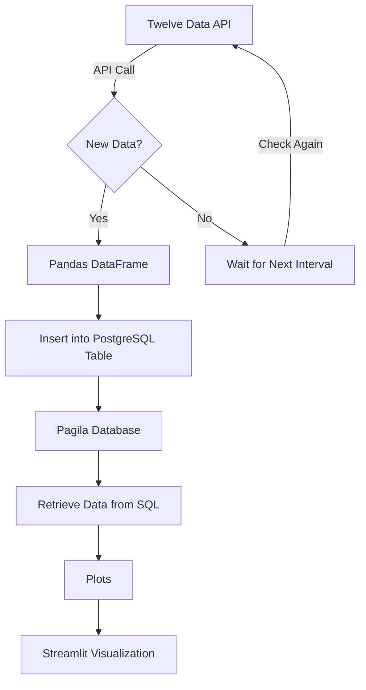

# Minimal Viable Product (MVP) Overview

## Project Goal
This project aims to extract financial data from the Twelve Data API, process it into a single source of truth (SSOT), store it in a PostgreSQL database, and visualize insights using Streamlit.

## Data Flow Process



## Prerequisites
- Python 3.x installed
- PostgreSQL database set up with the Pagila schema
- Required Python dependencies installed (use `pip install -r requirements.txt`)
- Twelve Data API key configured

## Key Components

### **1. Data Extraction**
- **Source:** Twelve Data API (Cryptocurrency & Stocks Data)
- **Frequency:** Hourly updates
- **Format:** JSON response converted to Pandas DataFrame

### **2. Data Transformation**
- **Objective:** Convert raw API data into a structured, analysis-ready format.
- **Operations:**
  - Merge relevant data fields
  - Compute key metrics (e.g., averages, price changes)
  - Structure data for optimized querying

### **3. Data Storage (PostgreSQL - Pagila Schema)**
- **Database:** PostgreSQL (Pagila schema)
- **Purpose:** Store consolidated SSOT data for efficient analysis and reporting.

### **4. Visualization with Streamlit**
- **Tool:** Streamlit
- **Purpose:** Display real-time financial insights
- **Metrics:** Stock/crypto trends, comparisons, key indicators

## Running the ETL Pipeline
To execute the pipeline, run the following command from the root folder:
```sh
python -m scripts.run_etl
```
The scheduler ensures data updates run every hour.

## Running the Streamlit App
To launch the Streamlit dashboard, run:
```sh
streamlit run app.py
```

## Areas of Improvement
- **Utilizing Real-Time API Streaming**: Instead of periodic updates, leverage the API's real-time streaming capabilities to enhance data freshness.
- **Performance Optimization**: Improve data ingestion and transformation efficiency to scale with larger datasets.
- **Enhanced Visualizations**: Integrate more interactive components into the Streamlit dashboard.

## Screenshots
_(Add relevant screenshots here to demonstrate project functionality.)_

