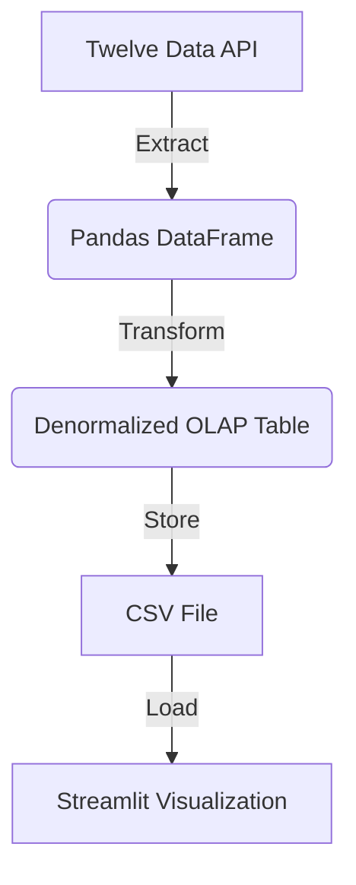

# CapstoneProject

# Minimal Viable Product (MVP) Requirements

## Overview
The goal of this MVP is to create a simple yet effective data pipeline that extracts financial data from the Twelve Data API, processes it, and provides hourly visualization using Streamlit. This will help validate the feasibility of the project before scaling it further.

## Requirements

### 1. **Data Extraction (Highly Normalised)**
- **Source:** Twelve Data API
- **Scope:** Cryptocurrency and sales data
- **Frequency:** Hourly updates
- **Format:** JSON response converted to Pandas DataFrame
- **Storage:** Local storage (CSV)

### 2. **Data Transformation (OLAP Conversion)**
- **Objective:** Convert extracted normalised data into a OLAP (denormalized format) suitable for analysis.
- **Reasoning:**  
  - OLTP (Online Transaction Processing) data structures are highly normalized, optimized for quick write operations, and contain many related tables.
  - Analysts require fast querying without complex joins, which is best achieved by converting to an OLAP (Online Analytical Processing) format—denormalized for faster read operations and easier analysis.
  - This transformation will aggregate key metrics and create a single wide table for visualization.

### 3. **Data Loading and Visualization**
- **Visualization Tool:** Streamlit
- **Purpose:** Hourly monitoring of trends and insights
- **Metrics Displayed:** Price movements, averages, comparisons
- **Data Refresh Interval:** Every minute

---

## Goals of the MVP

1. **Prove Feasibility:**  
   - Demonstrate that we can successfully fetch and visualize data hourly.

2. **Simplify Data for Analysis:**  
   - Transform normalized OLTP data into a flat, denormalized OLAP structure.

3. **Quick Insights:**  
   - Allow analysts to view key insights without complex queries.

4. **Automation:**  
   - Automate data extraction and visualization to reflect live updates.

---

## Data Flow Diagram

